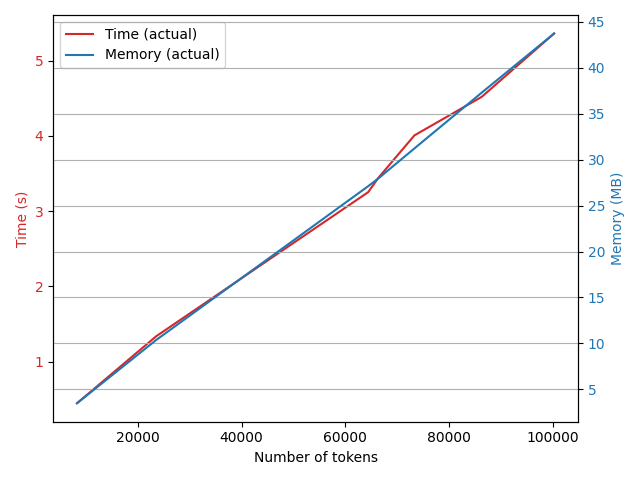

# Rapport du Groupe 2: Analyse syntaxique en dépendances

**Auteurs**: Liza FRETEL, Kenza AHMIA, Shami THIRION SEN

---

## Introduction

Dans le cadre du projet de l'implémentation d'une chaîne de traitement pour analyse du langage naturel en Python pour réaliser l'extraction des caractéristiques linguistique d'un corpus littéraire, les différentes tâches ont été divisés parmi les étudiants en M2. Le groupe 2 s'est chargé de **l'analyse syntaxique en dépendances** (module 2). Notre travail a consisté à :

- assurer la continuité du flux de données entre le précédent module et les modules suivants.
- ajouter des couches d'analyse supplémentaires.
- mesurer la complexité en termes de temps et d'espace pour optimiser les performances globales du système.
- représenter graphiquement la complexité.

---

## Chemin d'importation des modules

```python
sys.path.append(os.path.abspath(os.path.join(os.path.dirname(__file__), '../Groupe1')))
```

Cette ligne de code permet d'ajouter un chemin vers le répertoire Groupe1. De cette façon, nous pouvons importer `process_gp1` et `preprocess_gp1` depuis le script `groupe1.py` du repertoire Groupe1. Ces fonctions sont ainsi utilisées dans notre script pour effectuer des prétraitements et des traitements sur les données textuelles. En important uniquement ces fonctions, le script ne charge que ce qui est nécessaire, ce qui peut améliorer l'efficacité et la lisibilité du code. Nous avons recommandé aux autres groupes d'utiliser l'import entre les modules, car la structure du projet exigeait que chaque groupe ait son propre dossier et fichier.

---

## Fonctions principales

Nous implémentons 3 fonctions principales:

- `process_gp2(docs)`

- `time_and_memory_wrapper(func)`
- `plot_complexity()`

La fonction `process_gp2` est évaluée en termes de temps d'exécution et d'utilisation de la mémoire, afin d'identifier les éventuels goulots d'étranglement et d'optimiser le processus de traitement.

#### `process_gp2(docs)`
**Notre choix d'entrée**
A l'origine, le groupe 1 nous fournissait un dictionnaire de sortie ({tok: POS}). Malheureusement, il est impossible d'utiliser un constructeur de l'objet Doc de SpaCy. L'objet Doc doit être créé par les fonctions internes, notamment par la couche de tokenisation, qui est effectuée par le groupe 1. C'est pour cette raison que nous avons demandé au groupe 1 de nous renvoyer non pas un dictionnaire, mais la sortie de leur traitement. Nous leur avons aussi conseillé de n'utiliser que ce dont elles avaient besoin pour leur pipeline SpaCy, sinon leur résultat comprenait déjà l'analyse syntaxique.

**Notre traitement**
`process_gp2` est la fonction principale pour l'analyse syntaxique en dépendance. Elle utilise le pipeline NLP de SpaCy. Elle prend en entrée une liste de documents textuels et retourne une liste de tuples contenant des informations sur chaque token traité. Cette fonction est enveloppée par le décorateur `time_and_memory_wrapper`, ce qui permet de mesurer les performances de traitement. En évaluant cette fonction, on peut obtenir des informations sur les performances spécifiques du pipeline NLP utilisé, ce qui est crucial pour l'optimisation du système dans son ensemble. Grâce à la pipeline de SpaCy, nous avons pu isoler la tâche de l'analyse syntaxique et ainsi améliorer les performances de SpaCy, qui par défaut effectue 5 traitements différents.

**Notre choix de sortie**
Etant donné la simplicité du résultat l'analyse syntaxique, notamment le fait que `token.head` pointe sur un autre objet Token facilitant l'analyse du groupe 4, et que le groupe 3 nous a confirmé qu'il utiliserait également Spacy, nous avons décidé de ne pas créer de fonction postprocess qui modifierait le format des données.

#### `time_and_memory_wrapper(func)`

La fonction `time_and_memory_wrapper` est un décorateur qui permet de mesurer le temps d'exécution et la mémoire utilisée par une fonction donnée. En enveloppant une fonction avec ce décorateur, on obtient des informations sur les performances à chaque éxecution. Le décorateur utilise le module `tracemalloc` pour mesurer la mémoire utilisée (en octets) avant et après l'exécution de la fonction, et le module `time` pour mesurer le temps écoulé. Les résultats sont ensuite stockés dans les listes globales `time_data` et `memory_data`, permettant l'analyse, l'import et la visualisation ultérieurs.

#### `plot_complexity()`

`plot_complexity` génère un graphique représentant l'évolution de la complexité en fonction du nombre de tokens. Elle utilise les données collectées sur le nombre de tokens, le temps d'exécution et la mémoire utilisée pour chaque exécution de fonction. Ce graphique permet une visualisation claire des tendances de performance du en fonction de la charge de traitement. L'axe x représente le nombre de tokens, tandis que l'axe y représente à la fois le temps d'exécution et la mémoire utilisée. Cette fonction est essentielle pour détecter les éventuelless déficience et optimiser les performances globales du système.

---

## Le script 'groupe2.py'

Le script `groupe2.py` peut être appelé de 2 façons:

- **depuis le terminal**: `python ./groupe2.py` , afin d'effectuer l'analyse syntaxique et d'examiner les compléxités en temps et en mémoire en fonction du nombre de tokens de chaque fichier.
- **via l'import des modules** par d'autres groupes afin d'assurer la continuité dans la chaîne de traitement sans appeler la fonction main qui effectue les mesures.

---

## Résultats

- <u>Résultats de l'**analyse syntaxique en dépendances**</u> :

Les résultats du traitement syntaxique sont stockés dans un fichier TSV, ce qui présente plusieurs avantages. Ce format est simple et universel, facilitant l'exportation et l'importation des données entre divers outils et langages de programmation. Chaque colonne (Text, POS, Dep, Head) est séparée par une tabulation, garantissant une structure claire et lisible. Par exemple, l'entrée "JULES PROPN ROOT JULES" indique que "JULES" est un nom propre (PROPN) et la racine (ROOT) de cette phrase, se référant à lui-même comme tête. Le format TSV permet une visualisation des résultats de l'analyse syntaxiques. Ce format n'a été utilisé que pour pouvoir représenter l'objet Doc de SpaCy de façon lisible, et n'est pas transmis aux autres groupes. Il est généré lors de l'appel depuis le terminal. Il y a cependant un défaut à notre format: Head ne pointe pas vers un token, avec un indice de token, mais n'affiche qu'un mot, ce qui peut être ambigu si un mot apparaît deux fois dans une phrase.

| Text        | POS   | Dep    | Head        |
| ----------- | ----- | ------ | ----------- |
| JULES       | PROPN | ROOT   | JULES       |
| VERNE       | ADP   | xcomp  | JULES       |
| CINQ        | NUM   | nummod | SEMAINES    |
| SEMAINES    | NOUN  | ROOT   | SEMAINES    |
| EN          | ADP   | case   | BALLON      |
| BALLON      | PROPN | nmod   | SEMAINES    |
| VOYAGE      | NOUN  | ROOT   | VOYAGE      |
| DE          | ADP   | case   | DÉCOUVERTES |
| DÉCOUVERTES | NOUN  | nmod   | VOYAGE      |
| EN          | ADP   | case   | AFRIQUE     |
| AFRIQUE     | PROPN | nmod   | VOYAGE      |
| PAR         | ADP   | case   | ANGLAIS     |

- <u>Résultats de la fonction **plot_complexity**</u>

Les résultats montrent que le temps d'exécution et l'utilisation de la mémoire augmentent généralement avec le nombre de tokens traités, reflétant une corrélation entre la complexité syntaxique des textes et les ressources nécessaires. Par exemple, "JV-5_semaines_ballon.txt" et "JV-Tour_monde.txt" ont nécessité les ressources les plus élevées, avec des temps d'exécution de 6.36 et 5.97 secondes respectivement, et une mémoire de 43.73 MB et 37.30 MB. Ces données soulignent l'importance d'optimiser les fonctions de traitement pour gérer efficacement des corpus plus volumineux et complexes.



---

## Défis rencontrés

Contrairement, au projet réalisé lors du 1er semestre, pour le projet actuel nous n'avons pas réussi à organiser une réunion préparatoire afin de commencer les étapes. Comme nous pouvions le deviner, ceci a généré quelques malentendus concernant la chaîne de traitement et la structure de sortie attendus par les groupes suivants. Néanmoins, nous avons réussi à nous organiser avec les groupes précédent et suivant, afin que que les modules soient exploitables, sans «casser» la chaîne de traitement.

---

## Conclusion

Ce rapport présente une analyse approfondie des performances des fonctions de traitement NLP, en mettant l'accent sur la mesure du temps d'exécution et de l'utilisation de la mémoire. En utilisant des outils de mesure appropriés et des visualisations graphiques, nous avons pu identifier les zones d'amélioration potentielles et guider le processus d'optimisation du système NLP. Ces informations sont essentielles pour assurer des performances optimales dans des environnements de traitement de texte à grande échelle.

---

## Bibliographie

- https://docs.python.org/3/library/tracemalloc.html
