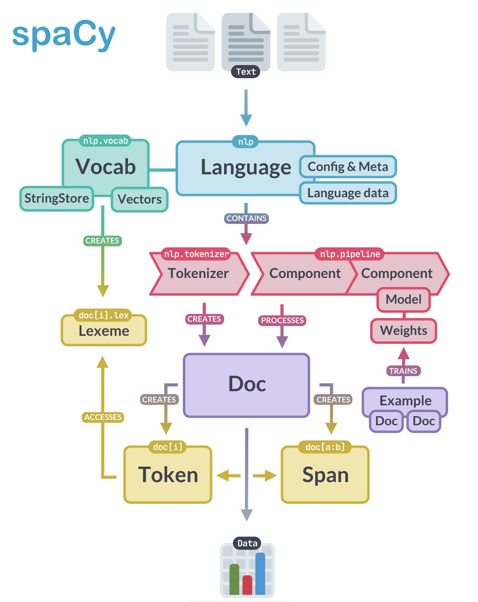
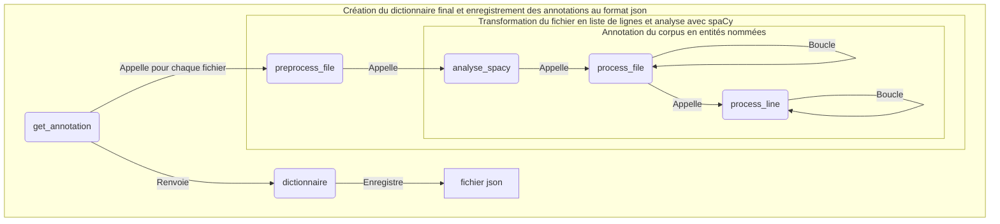

# Rapport Groupe 3 - Extraction des entités nommées

Notre tâche a été de créer un module qui prend en entrée un corpus de textes et fournit en sortie ces données annotées en entitées nommées. Ce module et sa sortie ont été conçus pour pouvoir s'insérer dans une chaîne de traitement en quatre étapes : étiquetage morpho-syntaxique (M1), analyse syntaxique en dépendances (M2), **extraction des entitées nommées (M3)**, et extraction des groupes nominaux (M4).

## I. Présentation des données et du modèle

### Le choix du module Spacy

Il a été fait en accord avec les autres groupes. En effet, puisque la chaîne de traitement était divisée en quatre tâche, nous avons décidé ensemble d'utiliser Spacy car ce module permet de rassembler les différentes tâches dans un seul objet : le SpacyDoc.



S'agissant des entités nommées (EN), le modèle Spacy utilise l'**annotation BIO**. Celle-ci associe une étiquette à chaque token. Cette étiquette est la lettre 'O' (pour "Outside") si le token n'est pas reconnu comme une EN. S'il est reconnu comme étant une EN, la lettre 'B' (pour "Beginning") lui est associée.

Si l'entité nommée reconnue est composée de plusieurs tokens, le ou les tokens suivants appartenant à la même entitée seront étiquetés avec la lettre 'I' (pour "inside").

Le SpacyDoc est créé et implémenté avec l'appel du modèle Spacy et l'affectation de son résultat à la variable docs : 

```python
docs = list(nlp.pipe(texte, disable=["parser", "lemmatizer", "attribute_ruler"]))
```

La variable docs est une liste de SpacyDoc (spacy.tokens.doc.Doc). Chaque élément de la liste correspond à une phrase segmentée en Token selon la formulation de Spacy. cf. Shéma SpacyDoc plus haut.

### Le choix du calcul de complexité

Le script du Groupe 5 qui est en charge d'intégrer les différentes modules, prend la sortie de notre script : `from Groupe3.groupe3 import get_annotations`

La fonction get_annotations() retourne une liste de 4 listes, dont les 3 premières seront utilisées afin qu'il puisse calculer la complexité moyenne en temps et en espace de chaque module : 

- la liste du nombre de tokens par texte
- la liste du temps d'exécution en sec par texte
- la liste des compteurs de la complexité empirique en espace mémoire. 

Nous avons un compteur supplémentaire qui calcule le nombre d'appels de fonction pendant l'execution 

### L'extraction des entités nommées et la construction des dictionnaires

Nous avons extrait tous les tokens et récupéré pour chaque token son étiquette I, B ou O.
Le format est un dictionnaire par phrase avec en clé l'indice du token dans la phrase commençant à 0 et en valeur un tuple comprenant : la forme du token et l'étiquette IOB.

Si le token est une EN sont étiquette sera donc 'B' ou 'I'.

On peut récupérer, à partir du Token de docs, les informations suivantes :

- la forme : `token.text`
- l'étiquette IOB : `token.ent_iob_`
- le type d'EN, soit l'étiquette : `token.ent_type_`

Ainsi, les EN peuvent être étiquetées sur plusieurs tokens qui se suivent. Dans notre script, nous lisons les éléments du le SpacyDoc, les tokens, un par un de manière séquentielle. Si une EN comporte plusieurs tokens, elle est donc éclatée en plusieurs dicos dans notre liste de dicos. À DEV VÉRFIER

On peut accéder à un tuple `doc.ents` qui regroupe les EN reconnues par le modèle sous leur forme regroupée, par exemple : "Royaume-Uni", "docteur Cicogna", au lieu de "Royaume", "-", "Uni", "docteur" "Cigogna". `.ents`. C'est une propriété de l'objet Doc, établie après la création et l'implémentation de l'objet SpacyDoc.

## II. Le module



## III. La compléxité empirique du module en temps et en espace

tableau

### Complexité empirique en espace

La complexité empirique en espace mémoire correspond au calcul du nombre d'éléments de toutes les séquences, les dictionnaires et des SpacyDoc.

Le nombre des éléments pris en compte est représentés par les len() et les sum() suivants :

- len(texte) l. 44 dans def preprocess_file() : le nombre des phrases dans un texte
- sum([len(doc) for doc in docs]) l. 64 dans def analyse_spacy() : la somme des Token de chaque phrase analysée (chaque SpacyDoc).
- (len(dicos) + len(docs)-1) + sum([len(doc) for doc in docs]) + sum([1 for dico in dicos for token in dico.keys()]) l. 90 dans def process_file() : le nombre de dictionnaires dans la liste dicos, le nombre restant de phrases analysées par Spacy dans la liste docs, le nombre d'éléments dans les dicos
  ??

### Complexité empirique en temps
