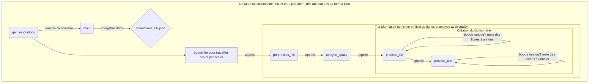

# Rapport Groupe 3 - Extraction des entités nommées

Notre tâche a été de créer un module qui prend en entrée un corpus de textes et fournit en sortie les données annotées en entitées nommées. Ce module et sa sortie ont été conçus pour pouvoir s'insérer dans une chaîne de traitement en quatre étapes : étiquetage morpho-syntaxique (M1), analyse syntaxique en dépendances (M2), **extraction des entitées nommées (M3)**, et extraction des groupes nominaux (M4).

## I. Présentation des données et du modèle

### Le choix du module Spacy

Il a été choisi en accord avec les autres groupes. En effet, puisque la chaîne de traitement était divisée en quatre tâches, nous avons décidé ensemble de l'utiliser car il permet de rassembler les différentes tâches dans un seul objet : le SpacyDoc.


### La tâche de reconnaissance des entités nommées (NER)

Une entité nommée est de manière globale tout mot forme qui pourrait être assimilé à un nom propre : les noms de personnes ou d'organisations, les sociétés, les noms de lieux, de pays, les États, les noms des œuvres, etc.

Contrairement aux tâches d'étiquetage en parties du dicours ou de lemmatisation qui octroient une étiquette par token, la reconnaissance des entités nommées cherche à identifier un token ou souvent un empan, une séquence de tokens (span), pour l'étiqueter. La reconnaissance d'EN du modèle Spacy est donc une fonctionnalité pré-entraînée. La composante `ner` du modèle utilise sa propre couche de vecteurs (tok2vec) afin de prédire les EN. Vous pouvez retrouver des informations supplémentaire dans la [documentation spacy](https://spacy.io/api/entityrecognizer).

L'entraînement du modèle de reconnaissance des EN de Sapcy a été réalisé avec les données wikipedia du corpus [*Wikiner*](https://figshare.com/articles/dataset/Learning_multilingual_named_entity_recognition_from_Wikipedia/5462500).

#### L'annotation BIO

On peut récupérer, à partir du token d'un objet SpacyDoc, les informations suivantes : 

- la forme : *token*.text
- l'étiquette IOB : *token*.ent_iob_
- le type d'EN, soit l'étiquette : *token*.ent_type_

Le modèle Spacy utilise l'**annotation BIO**. Celle-ci associe une étiquette à chaque token. Cette étiquette est la lettre 'O' (pour "Outside") si le token n'est pas reconnu comme une EN. S'il est reconnu comme étant une EN, la lettre 'B' (pour "Beginning") lui est associée. Si l'entité nommée reconnue est composée de plusieurs tokens, le ou les tokens suivants appartenant à la même entitée seront étiquetés avec la lettre 'I' (pour "Inside").

Le SpacyDoc est créé et implémenté avec l'appel du modèle Spacy et l'affectation de son résultat à la variable docs : 

```python
docs = list(nlp.pipe(texte, disable=["parser", "lemmatizer", "attribute_ruler"]))
```

La variable docs est une liste de SpacyDoc (spacy.tokens.doc.Doc). Chaque élément de la liste correspond à une phrase segmentée en Token selon la formulation de Spacy (cf. [schéma SpacyDoc](https://github.com/AgatheWallet/Projet_M2S2_Pap/blob/main/Groupe3/rapport_groupe3.md#le-choix-du-module-spacy)).

### Le choix du calcul de complexité

Le script du Groupe 5 qui est en charge d'intégrer les différentes modules, prend la sortie de notre script : `from Groupe3.groupe3 import get_complexities`

La fonction `get_complexities() `retourne une liste de 4 listes, dont les 3 premières seront utilisées afin qu'il puisse calculer la complexité moyenne en temps et en espace de chaque module : 

- la liste du nombre de tokens par texte
- la liste du temps d'exécution en sec par texte
- la liste des compteurs de la complexité empirique en espace mémoire. 

Nous avons un compteur supplémentaire qui calcule le nombre d'appels de fonction pendant l'execution, une métrique qui nous a paru intéressante pour notre programme récursif. 

### La construction des dictionnaires

Nous avons récupéré pour chaque token son étiquette : I, B ou O, et son label (`.ent_type_` : le type de l'entité nommée) s'il en a un. Le format du dictionnaire a été fait selon les demandes du groupe 5 pour permettre une extraction facile des labels des entités nommés. Il suit les règles suivantes :

```python
  {
    "nom_du_fichier" : {
      "phrase_n" : {
        "token_n" : {
          "form" : token.text,
          "ner" : "O"
        },
        "token_n+1" : {
          "form" : token.text,
          "ner" : token.ent_iob+"-"+token.ent_type_
        }
      }
    }
  }
```

L'annotation a été effectuée token par token. Spacy propose également une sortie qui regroupe les tokens, mais cette sortie ne s'accordait pas avec celles des autres modules de la chaîne de traitement.

## II. Le module



Il n'y a pas eu de problèmes particulièrement compliqués pendant l'écriture du fichier ou l'intégration des compteurs. Le groupe 5 nous a fait remarquer qu'il y avait des tokens vides annotés dans notre sortie. En fait, Spacy comptait comme token tout endroit où plusieurs espaces de succédaient. Un simple nettoyage du texte a suffit à résoudre ce problème. 

## III. La compléxité empirique du module en temps et en espace

S'agissant de la complexité du modèle de reconnaissance d'EN de Spacy, nous n'avons pas trouvé de référence à une annonce de complexité dans un article. Nous apprenons seulement sur leur site qu'il s'appuie sur un algorithme basé sur les transitions (*transition-based algorithm*) et qu'il recherche des empans de tokens "qui ne se chevauchent pas" ([cf. la documentation spacy](https://spacy.io/api/entityrecognizer)).

### Complexité empirique en espace

Nous avons utilisé le compteur `cpt_espace` pour savoir combien d'éléments au maximum se trouvaient dans les listes et dictionnaires pendant l'exécution du module. Dans la fonction *preprocess_file()*, on calcule le nombre de phrases dans la variable `texte`. Dans la fonction *analyse_spacy()*, on ajoute le nombre de Token de chaque SpacyDoc se trouvant dans la variable `docs`. Dans la fonction *process_file()*, à chaque appel de la fonction, on vérifie le nombre d'éléments dans la liste `docs`, dans le dictionnaire `dicos` et on modifie `cpt_espace` s'il est plus petit que `cpt_def` pour garder la plus grande valeur.

### Complexité empirique en temps

Nous avons de compteurs pour cette complexité. Avec le module `time`, on obtient le temps d'exécution du module à chaque annotation d'un fichier. Cependant, à chaque appel de la fonction *get_complexities()*, le résultat de la mesure n'est pas identique celui fait précédemment car le temps d'exécution est influencé beaucoup d'autres facteurs : le nombre de tâches en arrière-plan, le type de machine utilisé, ordre de grandeurs très différent au compteur `cpt_espace`, etc.

Nous avons donc cherché une autre mesure et nous avons choisi de calculer le nombre d'appels de fonctions à chaque exécution du module à l'aide du compteur `cpt_temps`. C'était d'autant plus intéressant que notre module était récursif.

### Analyse des complexités

| corpus               | nb tokens | espace (nb éléments) | temps (sec.) | temps (nb appels) |
| -------------------- | --------- | -------------------- | ------------ | ----------------- |
| JV-Terre_Lune        | 66352     | 68107                | 21.422       | 68969             |
| JV-Revoltes_Bounty   | 8266      | 8708                 | 2.138        | 8585              |
| JV-5_semaines_ballon | 98817     | 102264               | 41.154       | 104494            |
| JV-Tour_monde        | 86349     | 88928                | 31.189       | 90822             |
| JV-Forceurs_blocus   | 23525     | 24606                | 6.646        | 24932             |
| JV-Robur             | 73354     | 75576                | 25.532       | 76601             |
| JV-Begum             | 64440     | 66132                | 19.266       | 66949             |
*tableau des compteurs pour chaque fichier du corpus*

On peut déjà observer avec notre corpus de 7 textes que les ordres de grandeurs des variables du calcul de complexité (ici le nbre de tokens, le nombre d'éléments et le nombre d'appels) sont similaires.


L'espace mémoire maximal et le nombre d'appels des fonctions augmentent de manière corrélée et linéaire à mesure de l'augmentation du nombre de tokens. 

Le temps d'exécution mesuré en seconde par le module *time* est sensible à la quantité de tokens traitée par le script. Sa courbe présente une petite cassure. Elle est liée au fait que deux textes : le texte *JV-Terre_Lune* (4e point) et *JV-Begum* (5e point) ont des tailles proches en nombre de tokens (66352 et 64440 respectivement) et sont donc proches en temps d'exécution environ 22 et 24 secondes. Nous ne pouvons pas en tirer de conclusions sur ce compteur. Peut-être aurions-nous dû faire comme le groupe 5 et normaliser nos mesures avant de créer nos graphes et d'analyser les résultats.

Cependant, la tendance des courbes des plots est quasi-linéaire, cela nous laisse penser que l'on a une complexité empirique de l'ordre de **O(*n*)**.
