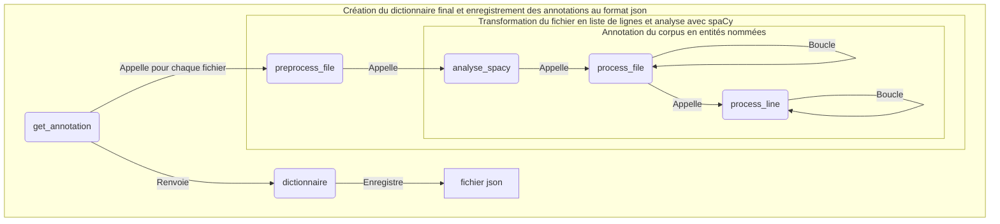

# Rapport Groupe 3 - Extraction des entités nommées

Notre tâche a été de créer un module qui prend en entrée un corpus de textes et fournit en sortie ces données annotées en entitées nommées. Ce module et sa sortie ont été conçus pour pouvoir s'insérer dans une chaîne de traitement en quatre étapes : étiquetage morpho-syntaxique (M1), analyse syntaxique en dépendances (M2), **extraction des entitées nommées (M3)**, et extraction des groupes nominaux (M4).

## I. Présentation des données et du modèle

### Le choix du module Spacy

Il a été choisi en accord avec les autres groupes. En effet, puisque la chaîne de traitement était divisée en quatre tâche, nous avons décidé ensemble de l'utiliser car ce module permet de rassembler les différentes tâches dans un seul objet : le SpacyDoc.

<p align="center">
  
</p>

S'agissant des entités nommées (EN), le modèle Spacy utilise l'**annotation BIO**. Celle-ci associe une étiquette à chaque token. Cette étiquette est la lettre 'O' (pour "Outside") si le token n'est pas reconnu comme une EN. S'il est reconnu comme étant une EN, la lettre 'B' (pour "Beginning") lui est associée. Si l'entité nommée reconnue est composée de plusieurs tokens, le ou les tokens suivants appartenant à la même entitée seront étiquetés avec la lettre 'I' (pour "inside").

Le SpacyDoc est créé et implémenté avec l'appel du modèle Spacy et l'affectation de son résultat à la variable docs : 

```python
docs = list(nlp.pipe(texte, disable=["parser", "lemmatizer", "attribute_ruler"]))
```

La variable docs est une liste de SpacyDoc (spacy.tokens.doc.Doc). Chaque élément de la liste correspond à une phrase segmentée en Token selon la formulation de Spacy (cf. schéma SpacyDoc plus haut).

### Le choix du calcul de complexité

Le script du Groupe 5 qui est en charge d'intégrer les différentes modules, prend la sortie de notre script : `from Groupe3.groupe3 import get_complexities`

La fonction retourne une liste de 4 listes, dont les 3 premières seront utilisées afin qu'il puisse calculer la complexité moyenne en temps et en espace de chaque module : 

- la liste du nombre de tokens par texte
- la liste du temps d'exécution en sec par texte
- la liste des compteurs de la complexité empirique en espace mémoire. 

Nous avons un compteur supplémentaire qui calcule le nombre d'appels de fonction pendant l'execution, une métrique qui nous a paru intéressant pour notre programme récursif. 

### L'extraction des entités nommées et la construction des dictionnaires

Nous avons extrait tous les tokens et récupéré pour chaque token son étiquette I, B ou O et son label s'il en a un. Le format du dictionnaire a été fait selon les demandes du groupe 5 pour permettre une extraction facile des labels des entités nommés. Il suit  les règles suivantes :

```json
  {
    "nom_du_fichier" : {
      "phrase_n" : {
        "token_n" : {
          "form" : token.text,
          "ner" : "O"
        },
        "token_n+1" : {
          "form" : token.text,
          "ner" : token.ent_iob+"-"+token.ent_type_
        }
      }
    }
  }
```

L'annotation a été effectuée token par token. Spacy propose également une sortie qui regroupe les tokens, par exemple `("guerre fédérale des États-Unis", "MISC")`, mais cette sortie ne s'accordait pas avec celles des autres modules de la chaîne de traitement. Nous l'avons mis de côté.


## II. Le module



## III. La compléxité empirique du module en temps et en espace

| corpus               | nb tokens | espace (nb éléments) | temps (sec.) |temps (nb appels)  |
|----------------------|-----------|----------------------|--------------|-------------------|
| JV-Terre_Lune        | 66352     | 68107                | 21.422       | 68969             |
| JV-Revoltes_Bounty   | 8266      | 8708                 | 2.138        | 8585              |
| JV-5_semaines_ballon | 98817     | 102264               | 41.154       | 104494            |
| JV-Tour_monde        | 86349     | 88928                | 31.189       | 90822             |
| JV-Forceurs_blocus   | 23525     | 24606                | 6.646        | 24932             |
| JV-Robur             | 73354     | 75576                | 25.532       | 76601             |
| JV-Begum             | 64440     | 66132                | 19.266       | 66949             |


### Complexité empirique en espace

La complexité empirique en espace mémoire correspond au calcul du nombre d'éléments de toutes les séquences, les dictionnaires et des SpacyDoc.

Le nombre des éléments pris en compte est représentés par les len() et les sum() suivants :

- len(texte) l. 44 dans def preprocess_file() : le nombre des phrases dans un texte
- sum([len(doc) for doc in docs]) l. 64 dans def analyse_spacy() : la somme des Token de chaque phrase analysée (chaque SpacyDoc).
- (len(dicos) + len(docs)-1) + sum([len(doc) for doc in docs]) + sum([1 for dico in dicos for token in dico.keys()]) l. 90 dans def process_file() : le nombre de dictionnaires dans la liste dicos, le nombre restant de phrases analysées par Spacy dans la liste docs, le nombre d'éléments dans les dicos
  ??

### Complexité empirique en temps
