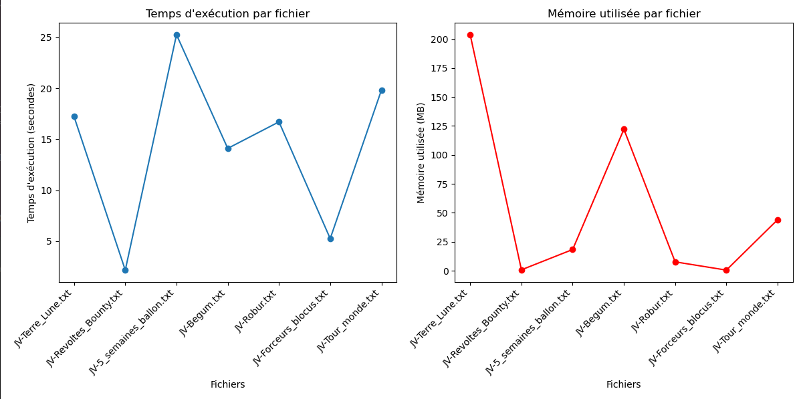

## Extraction de groupes nominaux
##### Clément BUON, Fanny BACHEY, Tifanny NGUYEN

### Méthodes et réalisation

Notre travail était d'extraire les groupes nominaux.

Pour se faire, nous avons utilisé spacy, notamment l'attribut 'noun-chunks' qui permet de les extraire. Nous avons crée une liste de la même taille que le nombre de tokens pour les fusionner en un tuple, chaque tuple étant numéroté par un numéro de token. La structure de données finale est une liste de dictionnaires, qui a pour clé le numéro du token courant de la phrase analysée et comme valeur le tuple (mot-forme, annotation en groupe nominal). Le dictionnaire a été demandé par le groupe 5.

Le groupe 5 nous a également demandé de retourner les complexités, nous comptions utiliser le wrapper du groupe 2 mais il ne marchait pas avec notre script. Nous avons donc fait un autre script dans lequel nous utilisons time pour la complexité du temps et psutil qui permet de donner la complexité en espace. Nous avons tracé les complexités avec matplotlib.pylot.

### Problèmes rencontrés

Le plus gros problème était le manque de temps. Le projet ayant été donné à la fin du semestre, au milieu des partiels et des autres cours, il a été difficile pour nous de nous organiser. Nous aurions dû faire un cahier des charges, peut-être, pour se mettre d'accord sur les sorties attendues par le groupe 5.

### Résumé du script

Notre script `groupe4.py` importe plusieurs modules : sys, os, glob, csv, typing, spacy pour l'extraction des groupes nominaux, time pour la complexité du temps et psutil pour celle en espace.
Il importe également les process du groupe 2 et du groupe 1.

Nous avons d'abord la fonction `measure_complexity` pour la mesure des complexités, un wrapper qui mesure la complexité du temps et de l'espace.

Ensuite, la fonction `measure_complexity` qui fait le travail demandé : il renvoie un dictionnaire avec la structure `{ numéro_de_token : (token_spacy, annotation_groupe_nominale) }` avec les conventions :
- B-GN (begin groupe nominal) pour le premier 
- I-GN ensuite
- O sinon 

La fonction récupère les objets spacy du groupe 2 et pour chaque phrase, elle l'annote, parcourt les groupes nominaux, les rassemble en tuples et ajoute le dictionnaire des annotations à la liste finale.

La dernière fonction `write_tsv` a été écrite car nous pensions donner un tsv au groupe 5, qui a fini par nous demander un dictionnaire. Elle permet d'avoir les annotations des phrases. Elle n'est cependant plus utilisée mais est quand même là pour vous permettre de voir les résultats du script.

### Résultats des complexités

En général, nous pouvons penser que le temps d'exécution d'un fichier serait proportionnel à la mémoire qu'il utilise. Cependant, avec ces tracés, nous pouvons voir que `JV-5_semaines_ballons.txt` a un temps d'exécution plus long alors qu'il est l'un des fichiers qui utilise le moins de mémoire. Ceci peut s'expliquer par le fait qu'il a un total de 100412 annotations alors que `JV-Forceurs_blocus.txt` qui est aussi un fichier qui n'utilise pas beaucoup de place en a 23525. Le nombre total d'annotations peut donc influer grandement sur les temps d'exécution.