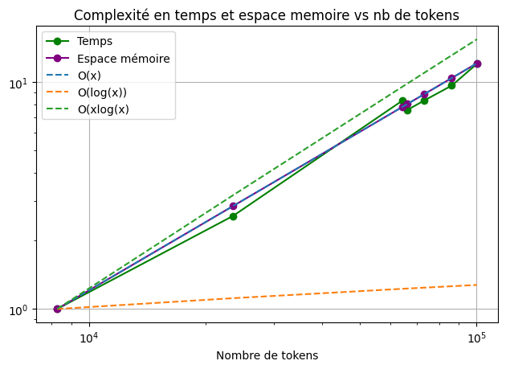
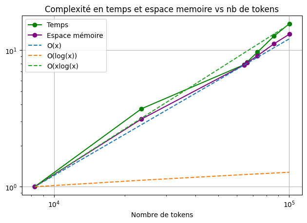
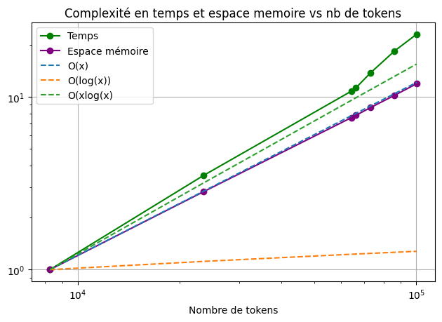
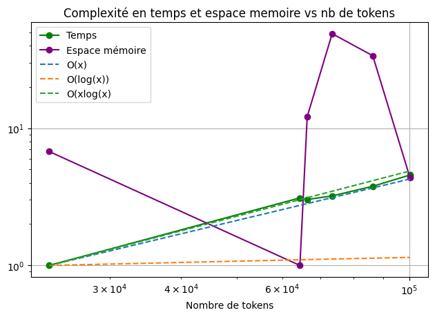
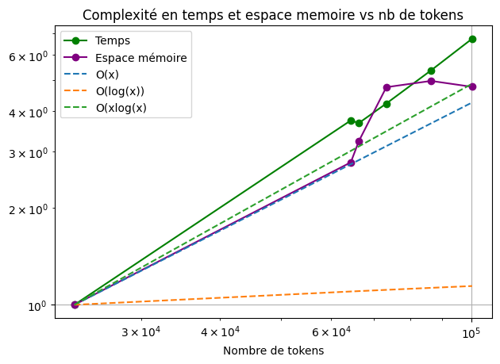

# Rapport Projet Groupe 5 - Florian Jacquot et Agathe Wallet

## Table des matières

1. [Utilisation](#utilisation)  

2. [Présentation du corpus](#présentation-du-corpus)  

3. [Description des modules](#description-des-modules)  
    3.1. [Partie annotation](#partie-annotation)  
    - [Module 1](#module-1)  
    - [Module 2](#module-2)  
    - [Module 3](#module-3)  
    - [Module 4](#module-4)  

    3.2. [Partie calcul de complexité](#partie-calcul-de-complexité)  
    - [Module 1](#module-1-1)  
    - [Module 2](#module-2-1)  
    - [Module 3](#module-3-1)  
    - [Module 4](#module-4-1)  

4. [Description de `main.py`](#description-de-mainpy)  

5. [Analyse de complexités](#analyse-de-complexités)  

6. [Les difficultés rencontrées et les tentatives de solutions](#les-difficultés-rencontrées-et-les-tentatives-de-solutions)  
    6.1  [Difficultés générales](#difficultés-générales)  
    6.2  [Difficultés par rapport aux calculs de complexités](#difficultés-par-rapport-aux-calculs-de-complexités)
---------------------------------------------------------------

Notre mission était un peu différente de celle des autres groupes puisque nous n'avions pas pour objectif de créer un module mais de rassembler les modules faits par les autres équipes pour pouvoir traiter le corpus de A à Z. Aussi, nous n'avons pas réellement de recherches préalables à notre travail à vous présenter.

L'infrastructure globale est conçue pour traiter un corpus de textex et générer un fichier de sortie type CoNLL (nous nous en sommes grandement inspiré mais notre fichier ne présente pas toutes les informations présentes dans un fichier conll et le découpage par phrase n'a pas toujours réussi. Il s'agit en fait plus d'un découpage par paragraphe). Il utilise les scripts des groupes 1 à 4 pour effectuer différentes tâches de traitement automatique des langues.

Le travail de notre groupe consistait donc à lire, comprendre et utiliser les travaux des différents groupes pour faire la chaîne de traitements suivante sur un corpus de textes :  
1. Étiquetage en partie du discours 
    - Groupe 1 : Sandra JAGODZINSKA et Valentina OSETROV
    - Module `Groupe1`
2. Analyse syntaxique et sémantique 
    - Groupe 2 : Kenza AHMIA, Liza FRETEL et Shami THIRION SEN
    - Module `Groupe2`
3. Reconnaissance des entités nommées
    - Groupe 3 : Laura DARENNE et Alice WALLARD
    - Module `Groupe3`
4. Reconnaissance des groupes nominaux 
    - Groupe 4 : Fanny BACHEY, Clément BUON et Tifanny NGUYEN
    - Module `Groupe4`
5. Rendre une sortie annotée exploitable du corpus 
    - Groupe 5 : Florian JACQUOT et Agathe WALLET
    - Code : `main.py`


## Utilisation 
Pour exécuter ce script, il suffit d'ouvrir un terminal et de taper la commande suivante :

```bash
python3 main.py chemin/du/corpus chemin/du/fichier/output.conll
```

où `chemin/du/corpus` est le chemin d'accès au corpus de texte à traiter, et `chemin/du/fichier/output.conll` est le chemin d'accès au fichier de sortie au format CoNLL à générer.

Le script affiche également des graphiques de complexité temporelle et spatiale pour chaque groupe de traitement, ainsi que pour l'ensemble du pipeline de traitement. Ces graphiques permettent de visualiser l'évolution de la complexité en fonction du nombre de tokens traités, et de comparer les performances des différents groupes de traitement.

## Présentation du corpus

Le corpus utilisé pour ce travail est constitué de l'ensemble des oeuvres de Jules Vernes disponibles sur le site de l'[Association des Bibliophiles Universels](http://abu.cnam.fr) (ABU).

Les textes sont disponibles sur le site au format d'encodage ISO-Latin-1. Pour simplifier les divers traitements, les textes ont été convertis en UTF-8.

## Description des modules

### Partie annotation

Pour cette partie, les quatre modules utilisent l'outil spaCy.

#### Module 1

Ce module contient les fonctions `process_gp1`, `recursive_tokens_pos`, `get_complexity_time` et `get_complexity_space`. Ces fonctions sont utilisées pour effectuer l'étiquetage en partie du discours (POS tagging) sur le corpus de texte. La fonction `process_gp1` prend en entrée une liste de chaînes de caractères et renvoie un objet `Doc` de spaCy contenant les tokens et leurs POS tags. La fonction `recursive_tokens_pos` est une fonction récursive utilisée pour attribuer les POS tags aux tokens dans l'objet `Doc`. Nous n'utilisons pas cette dernière car redondante avec la suite. Nous utilisons directement le `Doc` spaCy.

#### Module 2

Ce module contient les fonctions `process_gp2`, et les données `n_tokens`, `time_data` et `memory_data`. La fonction `process_gp2` est utilisée pour effectuer l'analyse syntaxique et sémantique sur le corpus de textes. Elle prend en entrée un objet `Doc` de spaCy contenant les tokens et leurs POS tags et renvoie un nouvel objet `Doc` de spaCy contenant les dépendances syntaxiques et sémantiques entre les tokens. La liste `n_tokens` renvoie le nombre de tokens dans le corpus. Les données `time_data` et `memory_data` renvoient les temps d'exécution et les utilisations de mémoire de l'algorithme d'analyse syntaxique et sémantique.

#### Module 3

Ce module contient les fonctions `get_annotations` et `get_complexities`. Ces fonctions sont utilisées pour effectuer la reconnaissance des entités nommées (NER) sur le corpus de texte. La fonction `get_annotations` prend en entrée le chemin d'accès à un corpus de textes et renvoie un dictionnaire contenant les annotations NER pour chaque token dans le corpus sous le format BIO. La fonction `get_complexities` prend en entrée le chemin d'accès à un corpus de texte et renvoie deux listes contenant les complexités temporelle et spatiale de l'algorithme de reconnaissance des entités nommées.

#### Module 4

Ce module contient la fonction `process_gp4`. Cette fonction est utilisée pour effectuer l'analyse des groupes nominaux sur le corpus de texte. Elle prend en entrée le chemin d'accès à un fichier du corpus de texte et renvoie une liste de dictionnaire contenant les groupes nominaux pour chaque phrase dans le corpus. 

### Partie calculs de complexité

Il y avait deux calculs à effectuer pour la complexité temporelle et spatiale. Les quatre groupes ont utilisé la même méthode pour calculer la complexité temporelle : le module python `time`. Ce module permet de mesurer le temps d'exécution d'un processus et calculant la différence entre deux mesures temporelles prises avant et après l'exécution dudit processus.

En revanche, les différents groupes ont utilisé une méthode différente pour le calcul de complexité spatiale que nous allons à présent décrire. De plus, les méthodes d'implémentation de ces calculs différent également entre modules.

#### Module 1

Ce module utilisent les fonctions `get_complexity_time` et `get_complexity_space` pour calculer la complexité temporelle et spatiale de l'algorithme d'étiquetage en partie du discours. La première calcule simplement le temps d'exécution du reste des fonctions du programme. Ces dernières enregistrent des données dans un dictionnaire instancié en variable global, ce qui leur permet de le récupérer dans tout le programme. La seconde fonction `get_complexity_space` mesure le nombre d'éléments contenus dans ce dictionnaire.

Pour récupérer les mesures de complexité, nous avons fait appel à ces fonctions aux emplacements appropriés de notre code.

#### Module 2

Ce module utilise un décorateur python pour faire les mesures de complexité. Ainsi, ce décorateur appliqué à la fonction principale de leur programme permet de faire les mesures à chaque utilisation de cette dernière et de les enregistrer dans des variables types liste globales.

La mesure de la complexité spatiale se fait ici par le module python `tracemallocs` qui permet de mesurer les utilisation de mémoire par un programme.

Pour récupérer les mesures de complexité, nous avons récupéré les variables listes globales.

#### Module 3

Ce module utilise une fonction `get_complexities` pour faire les mesures.  Cette dernière exécute la fonction principale du programme sur le corpus et mesure sont temps d'éxécution pour chaque fichier du corpus. La fonction principale renvoie un compteur qui s'incrémente de la longueur de la liste texte lorsque celle-ci est lue depuis le fichier d'entrée. Elle s'incrémente également de la somme des longueurs de tous les objets `Doc` dans la liste docs lorsque celle-ci est créée à partir de la liste texte en utilisant la méthode `nlp.pipe()`. Enfin, elle est incrémentée de la somme des longueurs de tous les dictionnaires dans la liste dicos lorsque celle-ci est créée en utilisant la méthode `process_file()`.

Pour récupérer ces mesures, nous faisons simplement appel à la fonction `get_complexities`.

#### Module 4

Comme pour le module 2, ce module utilise un décorateur python pour faire les mesures de complexité. En revanche, celui-ci n'utilise pas de variable type liste globale. C'est le décorateur lui-même qui renvoie, en plus du résultat de la fonction sur laquelle il est appliqué, les mesures de comlexité.

Comme pour les autres modules, la mesure temporelle se fait avec le module `time`. La mesure de la complexité spatiale se fait avec le module `psutil` qui fournit une interface pour interroger des informations sur le système d'exploitation et les processus en cours d'exécution. Ici, il est utilisé pour mesurer la quantité de mémoire utilisée par le processus Python en cours d'exécution. Le décorateur enregistre la quantité de mémoire utilisée par le processus Python au début et à la fin de l'exécution de la fonction, en utilisant la méthode memory_info().rss de l'objet Process de `psutil`. La différence entre les deux mesures est utilisée pour calculer la quantité de mémoire utilisée par la fonction elle-même.

Ces mesures sont récupérées dans notre code lors de l'appel de la fonction pricipale `process_gp4`.

## Description de `main.py`

Le script commence par importer les modules et fonctions nécessaires, y compris les scripts des groupes 1 à 4.

Ensuite, il définit plusieurs fonctions pour traiter le corpus de texte et générer le fichier de sortie au format CoNLL. Les principales fonctions pour l'analyse linguistiques sont les suivantes :

* `pretraitement_dico_gn` : cette fonction prend en entrée un dictionnaire contenant les résultats de l'analyse des groupes nominaux (groupe 4) et renvoie un nouveau dictionnaire avec une structure plus adaptée pour la suite du traitement.
* `analyse_line` : cette fonction prend en entrée un objet Doc de spaCy représentant une ligne de texte, ainsi que trois dictionnaires contenant les résultats des analyses précédentes, et renvoie un dictionnaire contenant les résultats de l'analyse de la ligne de texte.
* `get_pos`, `get_dep`, `get_ne`, `get_np` : ces fonctions sont utilisées par `analyse_line` pour extraire les informations voulues de chaque token dans la ligne de texte, soit respectivement : sa partie du discours, sa dépendance syntaxique, son statut d'entités nommées, s'il fait partie d'un groupe nominal.
* `build_dico` : cette fonction prend en entrée le chemin d'accès à un corpus de texte et renvoie un dictionnaire contenant les résultats de l'analyse du corpus ainsi que toutes les mesures de complexité des différents modules.
* `build_conll` : cette fonction prend en entrée, le dictionnaire obtenu avec la fonction précédente qui contient toutes les informations dont on a besoin, et le chemin d'accès à un fichier de sortie type CoNLL, et génère le fichier de sortie.

Les fonctions pour la mesure de la complexité empirique sont les suivantes :

* `normalisation_complexity` : cette fonction prend en entrée une liste de données et normalise cette dernière selon la méthode _min-max normalization_. Cette méthode permet de normaliser les mesures de complexité renvoyées par les différents modules dans la plage de valeur $[0, 1]$, ce qui permet de mettre toutes ces valeurs sur un pied d'égalité (elles possèdent toutes le même poids sur la complexité après normalisation). En  effet, puisque chacun des modules mesure la complexité avec sa propre méthode, les plages de valeurs sont très différentes selon leur origine.
* `get_pipe_complexity` : cette fonction prend en entrée les listes de mesures récupérées des différents modules et extrait de ces listes le nombre de tokens des différents fichiers traités et les mesures en elles-même. Après extraction, ces différentes données sont normalisées avec la fonction `normalisation_complexity` puis les complexités sont additionnées pour avoir les mesure de complexités pour la chaîne de traitement complète. La fonction renvoie les nombres de tokens avec leurs mesures de complexités temporelle et spatiale qui leurs sont associés.
* `plot_complexities` : cette fonction affiche et sauvegarde les graphiques représentant les complexités temporelle et spatiale en fonction du nombre de tokens du fichier traité. Différentes fonction typiques sont également représentées pour faire une comparaison asymptotique et ainsi déterminer la complexité empirique de la chaîne de traitement : 
    - $f(x)=log(x)$
    - $f(x)=x$
    - $f(x)=x*log(x)$

Le script se termine par l'appel de la fonction `build_dico` avec le chemin d'accès au corpus de texte en entrée, et l'écriture du fichier de sortie au format CoNLL à l'aide de la fonction `build_conll`.

**Remarques :**

* Le script utilise la bibliothèque `spaCy` pour effectuer l'étiquetage en partie du discours, l'analyse syntaxique et sémantique, et la reconnaissance des entités nommées.
* Le script utilise la bibliothèque `matplotlib` pour tracer les complexités temporelles et spatiales des différentes étapes du traitement.
* Le script utilise la bibliothèque `numpy` pour effectuer des calculs numériques.
* Le script utilise la bibliothèque `io` pour rediriger la sortie standard vers une chaîne de caractères, afin de supprimer tous les affichages (notamment des modules) ralentissant l'exécution.

## Analyse de complexités

Le script permet de visualiser les graphiques représentant les complexités empiriques temporelle et spatiale des différents modules et de la chaîne de traitement complète, en fonction du nombre de tokens mis en entrée de la chaîne.

Pour aider à la visualisation et à la comparaison asymptotique, nous avons choisi une échelle asymptotique et nous avons normalisé les valeurs par rapport à la valeur minimale :

$$ y_i = \dfrac{y_i}{min(f)}$$

Pour faire cette normalisation, nous avons pris la liberté de supprimer les points nuls en faisant l'hypothèse qu'un point $y$ nul (c'est à dire une mesure de complexité totale temporelle ou spatiale égale à zéros) était sûrement dû à une erreur ou une mauvaise façon de calculer la complexité.

Nous avons ainsi obtenu les graphiques suivants :

**Complexité du Module 1**



Nous voyons que ce module semble avoir une complexité empirique proche de $O(x)$ en temps et en espace. En réalité, la complexité spatiale est parfaitement en accord avec $O(x)$ puisque celle-ci mesure la taille du dictionnaire qui associe une association clé-valeur par token, nous avons donc une correspondance un token pour une entrée du dictionnaire.

**Complexité du Module 2**



Nous voyons que ce module semble avoir une complexité empirique entre $O(x)$ et $O(xlog(x))$ en temps et en espace. Peut-être que la complexité en temps approche plus de $O(xlog(x))$ et celle en espace plus de $O(x)$ mais il est difficile de le dire sans des résultats avec un plus grand nombre de tokens en entrée.

**Complexité du Module 3**



Ce module présente une complexité empirique en espace parfaitement en accord avec $O(x)$ tandis que la complexité en temps est plus proche de $O(xlog(x))$ et semble être même supérieure à celle-ci.

**Complexité du Module 4**



Encore une fois, la complexité en temps semble être entre $O(x)$ et $O(xlog(x))$. En revanche, la courbe pour la complexité spatiale n'est pas vraiment interprétable. Il semble que les mesures faites par le module `psutil` ne sont pas fiables ici.

**Complexité de la chaîne complète**



Théoriquement, la complexité empirique de la chaîne de traitement complète devrait être proche de la complexité la plus élevé mesurée précédemment, donc plus que $O(xlog(x))$ pour la complexité temporelle et $O(x)$ pour la complexité spatiale (selon les trois premiers modules).

Pour la complexité temporelle, nous observons que c'est effectivement le cas. Et, bien que la mesure de complexité spatiale du module 4 complexifie les observations pour de la chaîne complète, nous pouvons tout de même voir que la complexité spatiale n'est pas trop divergente par rapport aux mesures faites sur les autres modules. Nous pouvons en conclure que la complexité spatiale du module 4 devrait également être proche de $O(x)$ (ou inférieur à celle-ci).

---
## Les difficultés rencontrées et les tentatives de solutions

La partie concernant l'intégration de tous les travaux en une unique chaîne de traitement s'est avérée être particulièrement difficile et éprouvante pour notre groupe. En effet, nous avons rencontré de nombreux obstacles et défis à relever tout au long de ce processus.

### Difficultés générales

Tout d'abord, bien que nous avions fourni un format de sortie que nous jugions optimal pour faciliter la manipulation des données, un dictionnaire Python, il n'a pas toujours été bien respecté. Aussi, la mise en commun des différents modules a été plus compliquée. 

Ensuite, la plupart des modules n'étaient pas fournis avec une notice ou une documentation sur la façon de les utiliser. Nous avons donc dû consacrer beaucoup de temps à comprendre les modes de fonctionnements de chaque modules, temps qui se faisait de plus en plus rare à mesure que la date de remise des travaux approchait. De plus, nous ne savions pas toujours exactement quelle fonction nous devions utiliser pour chaque groupe, car chaque groupe utilisait de nombreuses fonctions, certaines qui nous semblaient plus utiles que d'autres pour notre tâche. Certaines ne renvoyaient d'ailleurs aucun objet directement exploitable (comme un dictionnaire), et nous avons dû demander aux groupes concernés de nous expliquer comment leur fonction était utilisée, quelles extensions étaient possibles, etc. Certains modules étant incompatibles avec d'autres, nous avons essayé au mieux d'utiliser un peu du travail de chacun pour arriver au résultat final.

Nous avons également rencontré des problèmes avec certains caractères dans le corpus, que nous avons fini par supprimer (comme les tabulations et les espaces multiples qui entraînaient des décalages entre les différents dictionnaires générés par les différents modules).

De façon générale, comme beaucoup de travaux d'équipe, le problème majeur fut la communication. Il aurait fallu désigner un chef d'équipe dont la seule tâche aurait été de coordonner les travaux. Notre groupe a tenté de jouer ce rôle, mais cela s'est avéré compliqué en raison de la fin de semestre chaotique que nous connaissons.

### Difficultés par rapport aux calculs de complexités

Tout d'abord, lors de la lecture des scripts des différents groupes, nous avons rapidement réalisé qu'aucun module n'avait vraiment prévu de quoi nous donner accès à leurs mesures de complexité, il nous a donc fallu demander à plusieurs reprises, et parfois, le faire avec le groupe car le temps était compté et qu'il nous fallait avancer en parallèle sur notre propre partie. Nous avons dû à plusieurs reprises tenter des choses avec les scripts présents sur le git, et tout refaire après modifications. La diversité des méthodes de mesures de complexités, des méthodes de transmission et des formats de présentation de ces dernières a évidemment compliqué tout le processus d'extraction.

Malgré toutes ces difficultés, nous avons réussi à intégrer tous les travaux en une unique chaîne de traitement et à effectuer des calculs de complexité pour évaluer la complexité de notre chaîne. Nous sommes fiers d'avoir réussi à finaliser ce travail et souhaitons remercier le travail des différents groupes pour les échanges parfois compliqués mais enrichissants.

